# Predicting-Employee-Salaries-Using-Deep-Learning-ANN

Project Overview

* This project builds an Artificial Neural Network (ANN) model to predict employee salary based on demographic, education, and job-related features.
The task is a regression problem because salary is a continuous numeric value.

Dataset Description
Input Features

* Department (Categorical)

* Job_Title (Categorical)

* Experience_Years (Numerical)

* Education_Level (Categorical)

* Other numerical features like Age, etc.

Target Variable

* Salary (Numerical – continuous)

End-to-End Workflow

```mermaid
flowchart TD
A[Data Collection] --> B[Data Cleaning & Feature Selection]
B --> C[Categorical Encoding]
C --> D[Train–Test Split]
D --> E[Feature Scaling]
E --> F[ANN Model Building]
F --> G[Model Training]
G --> H[Model Evaluation]
H --> I[Performance Analysis]
```

Step 1: Data Cleaning & Feature Selection
What was done?

* Removed irrelevant columns like:
    Employee_ID, Name
* Selected only features that influence salary.

Why?

* IDs and names do not contribute to learning patterns.

* Reduces noise and improves model performance.

Step 2: Convert Categorical Data to Numerical (One-Hot Encoding)
What was done?

    df_encoded = pd.get_dummies(
         df,
        columns=['Department', 'Job_Title', 'Education_Level'],
        drop_first=True
    )

    df_encoded = df_encoded.astype(int)
What this does?

* Converts text values into binary numeric columns (0/1).

Example:

Department = Engineering
Department_Engineering = 1
Department_HR = 0 

Why this is important!

* ANN cannot understand text.

* One-Hot Encoding prevents false ranking (e.g., Manager > Intern).

* drop_first=True avoids dummy variable trap (multicollinearity).

Step 3: Split Features and Target
What was done?
                
    X = df_encoded.drop('Salary', axis=1)
    y = df_encoded['Salary']
Why?

* X → input features for ANN

* y → output (salary to predict)

Step 4: Train-Test Split

    X_train, X_test, y_train, y_test = train_test_split(
        X, y, test_size=0.2, random_state=42
    )
Purpose:

* 80% data → training

* 20% data → testing (unseen data)

Step 5: Feature Scaling (Standardization)

    scaler = StandardScaler()
    X_train = scaler.fit_transform(X_train)
    X_test = scaler.transform(X_test)
    
Why scaling is critical for ANN?

* ANN uses gradient descent.

* Large values (salary, experience) slow learning.

* Scaling brings all features to similar range.

Step 6: ANN Model Architecture
Model Structure

    model = Sequential() 
    
    model.add(Dense(64, activation='relu', input_shape=(X_train.shape[1],)))
    model.add(Dense(32, activation='relu'))
    model.add(Dense(1, activation='linear'))
Explanation:

Input layer:
* Number of neurons = number of features

Hidden layers:
* Learn complex, non-linear relationships

* ReLU activation improves learning speed

Output layer:

* 1 neuron (salary prediction)

* Linear activation for regression

Step 7: Compile the Model

    model.compile(
        optimizer='adam',
        loss='mse',
        metrics=['mae']
    )
Why these choices?

* Adam optimizer → fast & stable

* MSE (loss) → penalizes large errors

* MAE (metric) → easy to interpret error

Step 8: Train the Model

    history = model.fit(
        X_train,
        y_train,
        epochs=50,
        batch_size=32,
        validation_split=0.2
    )
What happens here:

* Model learns patterns from training data

* Validation data checks overfitting

*Loss reduces over epochs

Step 9: Model Evaluation

    loss, mae = model.evaluate(X_test, y_test)
    print("Test MAE:", mae)
Result:
Test MAE ≈ 3490
Interpretation

Model prediction error ≈ ₹3,500

Average salary range ≈ ₹60,000–₹150,000

Error ≈ 5% → Excellent performance

Step 10: Loss Curve Analysis

    plt.plot(history.history['loss'], label='Training Loss')
    plt.plot(history.history['val_loss'], label='Validation Loss')
    plt.legend()
    plt.show()
Observations:

* Training and validation loss decrease together

* No divergence between curves

Conclusion:

* No overfitting
* No underfitting
* Stable learning

🔍 Step 11: Salary Prediction

    y_pred = model.predict(X_test[:5])
Output Example
[137903, 75317, 68805, 126136, 143963]

✔ Realistic
✔ Within expected salary range

 Final Conclusion

* ANN model performs very well

* Low MAE

* No overfitting

* Predictions are realistic

* Suitable for real-world salary prediction

Key Takeaways

* Proper preprocessing is crucial for ANN

* One-Hot Encoding avoids categorical bias

* Feature scaling greatly improves convergence

* Loss curves are essential for model validation

